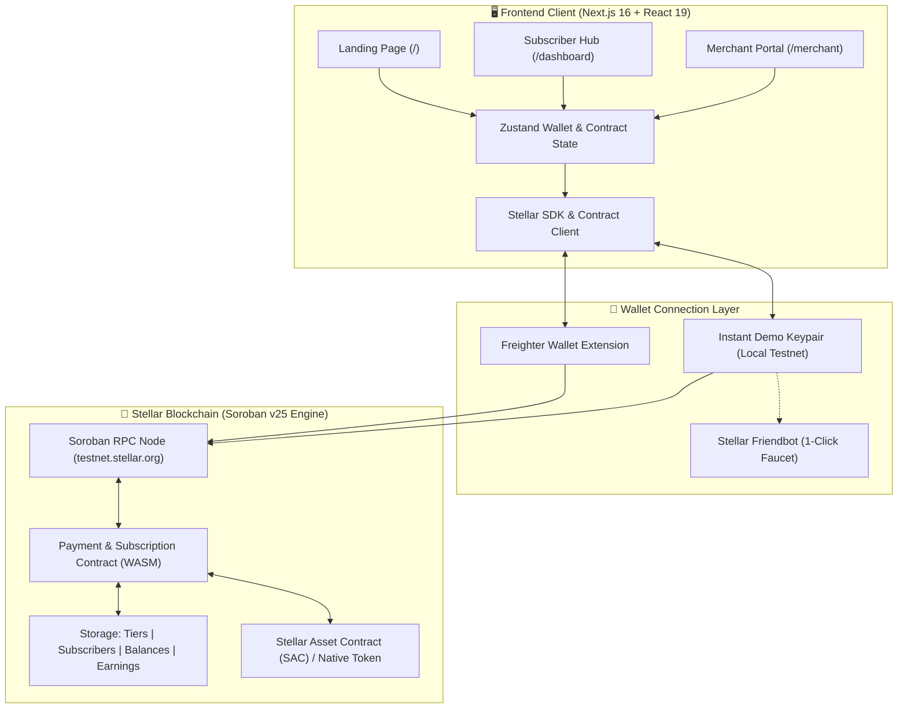
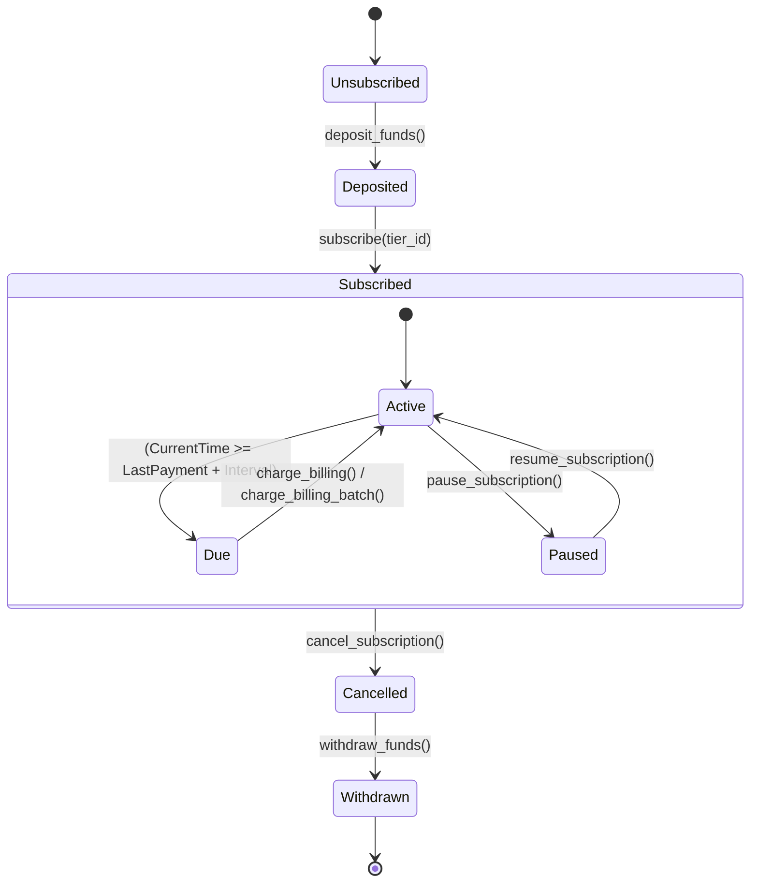

<div align="center">

# 💳 SorobanPay
### **Decentralized, Non-Custodial Subscription & Recurring Payments Protocol on Stellar**

[](https://stellar.org)
[](https://soroban.stellar.org)
[-000000?style=for-the-badge&logo=nextdotjs&logoColor=white)](https://nextjs.org)
[](https://react.dev)
[](https://www.typescriptlang.org/)
[](LICENSE)

<p align="center">
  <b>Bridging Web2 Subscription UX with Web3 Sovereign Custody.</b><br>
  No forced allowances, no locked funds, zero middlemen.
</p>

---

[⚡ Quick Demo](#-quick-start) • [📐 Architecture](#-system-architecture) • [🎮 Interactive Journeys](#-interactive-user-journeys) • [📜 Smart Contracts](#-smart-contract-deep-dive) • [🛠️ Deployment](#-deployment--scripts) • [❓ FAQ](#-troubleshooting--faq)

---

</div>

<br>

## 🧭 Interactive Table of Contents

- [🌟 What is SorobanPay?](#-what-is-sorobanpay)
- [⚡ Feature Highlights & Web2 vs Web3 Comparison](#-feature-highlights--comparison)
- [📐 System Architecture & Workflow](#-system-architecture)
- [🎮 Interactive User Journeys (Choose Your Path)](#-interactive-user-journeys)
  - [👤 1. Subscriber Journey (Deposit, Subscribe, Manage, Withdraw)](#-1-subscriber-journey)
  - [💼 2. Merchant & Admin Journey (Tiers, Analytics, Batch Billing, Claims)](#-2-merchant-portal-journey)
  - [🛠️ 3. Developer & Integrator Journey (SDK, CLI, Rust Testing)](#-3-developer--integrator-journey)
- [📜 Smart Contract Deep Dive & Specifications](#-smart-contract-deep-dive)
- [💻 Frontend dApp Structure & State Management](#-frontend-dapp-structure)
- [🚀 Quick Start & Local Development](#-quick-start)
- [🛠️ Deployment & Seeding Automation](#-deployment--scripts)
- [🧪 Testing & Quality Assurance](#-testing--quality-assurance)
- [❓ Troubleshooting & FAQ](#-troubleshooting--faq)

---

## 🌟 What is SorobanPay?

**SorobanPay** is an enterprise-grade, non-custodial recurring payment protocol built natively for the **Stellar Blockchain** using **Soroban Smart Contracts (Rust SDK v25)** and a high-performance **Next.js 16 (App Router)** client.

In traditional Web3, recurring payments are notoriously difficult: users must either sign manual transactions every billing cycle or grant risky unlimited ERC-20 allowances. **SorobanPay solves this** through a **trustless escrow-backed interval billing state machine**:

```text
┌──────────────────────────────────────────────────────────────────────────────────┐
│                             The SorobanPay Lifecycle                             │
│                                                                                  │
│   [User Wallet] ──── (1. Deposit) ───► [Smart Escrow Contract]                  │
│                                                   │                              │
│                                                   ├── (2. Auto-Charge Due Cycle) │
│                                                   ▼                              │
│   [User Wallet] ◄─── (3. Withdraw Unused) ── [Merchant Treasury Claim] ──► [Admin]│
└──────────────────────────────────────────────────────────────────────────────────┘
```

1. **Non-Custodial Escrow**: Subscribers pre-fund their personal balance in the smart contract.
2. **Permissionless Unused Withdrawals**: Users retain complete control and can withdraw their remaining funds at any second.
3. **Automated Batch Billing**: Merchants can atomically process dozens of due recurring subscriptions in a single transaction via `charge_billing_batch`.
4. **Pause, Resume & Cancel**: Subscribers can toggle their subscription on/off without losing billing history.

---

## ⚡ Feature Highlights & Comparison

| Feature | 💳 Legacy Web2 (Stripe) | ⛓️ Typical Web3 (Manual) | 🚀 **SorobanPay Protocol** |
| :--- | :--- | :--- | :--- |
| **Custody & Ownership** | Centralized processor holds funds & cards | Fully self-custodied | **100% Non-Custodial Smart Escrow** |
| **Payment Flow** | Auto-charged to credit card | Manual monthly wallet signing | **Automated Interval Pull + Batching** |
| **User Fund Sovereignty** | Chargeback disputes & account freezes | Full control | **Instant Withdrawals of Unspent Funds** |
| **Merchant Gas Cost** | 2.9% + $0.30 fee per charge | High gas per user interaction | **Sub-cent Stellar Fees + Batch Invocations** |
| **Wallet Onboarding** | Email/Password login | Mandatory extension install | **Dual Mode: Freighter + Instant Demo Keypair** |
| **Transparency** | Black-box payment routing | Public blockchain | **On-Chain Soroban Event Logs & Real-Time Telemetry** |

---

## 📐 System Architecture

### 1. High-Level Protocol Architecture



### 2. Subscription Billing State Machine



---

## 🎮 Interactive User Journeys

Click on the tabs below to expand interactive step-by-step walkthroughs for each persona:

<details open>
<summary><b>👤 Path 1: The Subscriber Journey (Click to Collapse/Expand)</b></summary>
<br>

Subscribers enjoy a seamless, secure Web3 subscription experience without giving up custody of their crypto.

```text
  [1. Connect Wallet] ──► [2. Top-Up Escrow] ──► [3. Select Tier] ──► [4. Active Status]
         │                                                                   │
         └───────────── (Withdraw Balance at Any Time) ◄─────────────────────┘
```

### Step-by-Step Flow:
1. **Connect Wallet / Instant Demo**:
   - Connect using **Freighter** or click **"Instant Demo Mode"** to instantly generate a funded testnet keypair with 10,000 testnet XLM.
2. **Fund Escrow Balance**:
   - In the **Subscriber Hub (`/dashboard`)**, use the quick-select pills (`+10`, `+25`, `+50`, `+100 XLM`) to deposit balance into the contract escrow.
3. **Choose a Subscription Tier**:
   - Browse published tiers (Starter, Pro, Enterprise).
   - Click **"Subscribe"** — the contract locks the first cycle and registers your active timestamp.
4. **Manage Lifecycle**:
   - **Pause / Resume**: Need a break? Click **Pause** to freeze billing. Resume anytime.
   - **Emergency Withdraw**: Withdraw unspent balance back to your wallet instantly with 0 merchant friction.
   - **Cancel**: 1-click immediate cancellation.

</details>

<br>

<details>
<summary><b>💼 Path 2: The Merchant & Admin Journey (Click to Expand)</b></summary>
<br>

Merchants receive a complete decentralized business operating system in `/merchant`.

```text
  [1. Create Tiers] ──► [2. Track Telemetry] ──► [3. Batch Billing] ──► [4. Claim Revenue]
   (On-Chain Storage)    (Live Active Subs)     (Atomic Multi-User)    (1-Click to Wallet)
```

### Step-by-Step Flow:
1. **Define On-Chain Subscription Tiers**:
   - Set Tier Name, Price (in XLM / Stroops), and Billing Interval (e.g., 30 days = 2,592,000s).
   - Sign transaction to commit directly to Soroban persistent storage.
2. **Real-Time Revenue Telemetry**:
   - View **Claimable Revenue**, **Monthly Recurring Revenue (MRR)**, **Total Active Subscribers**, and **Due Invoices**.
3. **Trigger Single or Batch Billing**:
   - When subscribers reach their renewal timestamp, their status turns to **"DUE"**.
   - Click **"Run Batch Billing"** (`charge_billing_batch`) to collect fees from all due accounts simultaneously in a single atomic transaction.
4. **Claim Revenue**:
   - Click **"Claim Earnings"** (`withdraw_merchant_earnings`) to transfer accumulated subscription revenue directly into the merchant's Stellar address.

</details>

<br>

<details>
<summary><b>🛠️ Path 3: The Developer & Integrator Journey (Click to Expand)</b></summary>
<br>

Build on top of the SorobanPay smart contract or integrate SorobanPay into your own dApps.

### Interacting via TypeScript SDK:
```typescript
import { server } from "@/lib/stellar";
import * as StellarSdk from "@stellar/stellar-sdk";

// Example: Check if a user's subscription is due
export async function checkDue(contractId: string, userAddress: string) {
  const contract = new StellarSdk.Contract(contractId);
  const tx = new StellarSdk.TransactionBuilder(account, { fee: "100" })
    .addOperation(
      contract.call("is_subscription_due", StellarSdk.Address.fromString(userAddress).toScVal())
    )
    .setTimeout(30)
    .build();

  const simResult = await server.simulateTransaction(tx);
  return StellarSdk.scValToNative(simResult.result.retval);
}
```

### Interacting via Stellar CLI:
```bash
# 1. Deposit 50 XLM into escrow
stellar contract invoke \
  --id CBKMFIRGM6VRW2ZMJCBIGFT7CNFUQJ5GFO7GUY2ML6RQKVZ3VD3HXAJP \
  --source-account alice \
  --network testnet \
  -- deposit_funds --user alice --amount 500000000

# 2. Subscribe to Tier 1
stellar contract invoke \
  --id CBKMFIRGM6VRW2ZMJCBIGFT7CNFUQJ5GFO7GUY2ML6RQKVZ3VD3HXAJP \
  --source-account alice \
  --network testnet \
  -- subscribe --user alice --tier_id 1 --initial_deposit 0
```

</details>

---

## 📜 Smart Contract Deep Dive

The core logic lives in [`contract/contracts/contract/src/lib.rs`](./contract/contracts/contract/src/lib.rs) and implements Soroban SDK v25.

### 🔑 Storage Key Schema (`DataKey`)

```rust
pub enum DataKey {
    Admin,                  // Instance storage: Address
    Token,                  // Instance storage: Address (SAC / Native XLM)
    Tier(u32),              // Persistent storage: SubscriptionTier
    TierCount,              // Instance storage: u32
    Subscriber(Address),    // Persistent storage: Subscriber
    Balance(Address),       // Persistent storage: i128 (Escrow deposit)
    MerchantEarnings,       // Instance storage: i128 (Accrued revenue)
}
```

### 📋 Full Function Interface

<details open>
<summary><b>Click to expand/collapse method reference table</b></summary>

| Function | Parameters | Authorization | Description |
| :--- | :--- | :--- | :--- |
| `initialize` | `admin: Address, token: Address` | None (once) | Initializes admin, accepted payment token, and counters. |
| `get_admin` | _none_ | Public | Returns the contract administrator address. |
| `get_token` | _none_ | Public | Returns the underlying payment token contract ID. |
| `get_merchant_earnings` | _none_ | Public | Returns total unwithdrawn merchant revenue. |
| `get_tier_count` | _none_ | Public | Returns total number of created subscription tiers. |
| `create_tier` | `admin, tier_id, price, interval` | `admin.require_auth()` | Creates a new subscription tier with price and cycle seconds. |
| `update_tier` | `admin, tier_id, price, interval` | `admin.require_auth()` | Updates pricing or interval of an existing tier. |
| `deposit_funds` | `user: Address, amount: i128` | `user.require_auth()` | Transfers tokens from user into contract escrow balance. |
| `withdraw_funds` | `user: Address, amount: i128` | `user.require_auth()` | Allows subscriber to withdraw unspent balance back to wallet. |
| `subscribe` | `user, tier_id, initial_deposit` | `user.require_auth()` | Subscribes user to tier and charges the first interval immediately. |
| `pause_subscription` | `user: Address` | `user.require_auth()` | Pauses recurring billing for user. |
| `resume_subscription` | `user: Address` | `user.require_auth()` | Resumes a previously paused subscription. |
| `cancel_subscription` | `user: Address` | `user.require_auth()` | Cancels active subscription immediately. |
| `charge_billing` | `merchant: Address, user: Address` | `merchant.require_auth()` | Charges a single user if `current_time >= last_payment + interval`. |
| `charge_billing_batch` | `merchant: Address, users: Vec<Address>` | `merchant.require_auth()` | Atomically bills a batch of due subscribers. |
| `withdraw_merchant_earnings` | `admin: Address, amount: i128` | `admin.require_auth()` | Transfers accrued earnings to the merchant wallet. |
| `get_subscriber` | `user: Address` | Public | Returns `{ tier_id, last_payment, active, paused }`. |
| `get_balance` | `user: Address` | Public | Returns deposited escrow balance of user. |
| `is_subscription_due` | `user: Address` | Public | Returns `bool` indicating whether billing cycle has elapsed. |

</details>

---

## 💻 Frontend dApp Structure

The frontend is crafted with **Next.js 16 (Turbopack)**, **React 19**, and **TailwindCSS**:

```text
client/
├── src/
│   ├── app/
│   │   ├── layout.tsx             # Root layout with fonts & global providers
│   │   ├── page.tsx               # High-converting Hero & Protocol overview
│   │   ├── globals.css            # Dark glassmorphic design system
│   │   ├── dashboard/
│   │   │   └── page.tsx           # Subscriber Management Hub
│   │   └── merchant/
│   │       └── page.tsx           # Merchant Telemetry & Operations
│   ├── components/
│   │   ├── Navbar.tsx             # Wallet connector, Testnet status & Navigation
│   │   ├── SubscriptionTiers.tsx  # Dynamic Tier Cards with subscribe actions
│   │   ├── TransactionTracker.tsx # Real-time transaction feedback toast/modal
│   │   ├── ActivityFeed.tsx       # Live on-chain event stream
│   │   └── WalletConnect.tsx      # Dual-mode modal (Freighter + Instant Demo)
│   ├── hooks/
│   │   └── useContract.ts         # React hook for contract queries & mutations
│   └── lib/
│       ├── stellar.ts             # Stellar RPC client, Freighter API & keypair helpers
│       ├── store.ts               # Zustand global state (wallet, tiers, balance)
│       └── utils.ts               # Formatting (Stroops -> XLM, date formatting)
```

---

## 🚀 Quick Start

Follow these steps to run SorobanPay locally in less than 2 minutes:

### 1. Clone & Install Dependencies

```bash
# Clone repository
git clone https://github.com/shikhaj-stack/soroban-payment-dapp.git
cd soroban-payment-dapp/client

# Install frontend dependencies
npm install
```

### 2. Environment Variables

Create or verify `client/.env.local`:

```env
# Stellar Testnet RPC Endpoint
NEXT_PUBLIC_RPC_URL=https://soroban-testnet.stellar.org

# Stellar Network Passphrase
NEXT_PUBLIC_NETWORK_PASSPHRASE=Test SDF Network ; September 2015

# Deployed Soroban Contract ID on Testnet
NEXT_PUBLIC_CONTRACT_ADDRESS=CBKMFIRGM6VRW2ZMJCBIGFT7CNFUQJ5GFO7GUY2ML6RQKVZ3VD3HXAJP

# Payment Token Address (Native XLM SAC on Testnet)
NEXT_PUBLIC_TOKEN_ADDRESS=CDLZFB3OFI6D26GFNIZM7MPIIPEEZZ2DCCYNEI4RWG5RUVY475YGLUM
```

### 3. Launch Development Server

```bash
npm run dev
```

Open [**http://localhost:3000**](http://localhost:3000) in your browser.

> [!TIP]
> **No Freighter wallet?** No problem! Click **"Instant Demo Mode"** in the top-right corner to automatically create a funded testnet keypair and start exploring all features instantly!

---

## 🛠️ Deployment & Scripts

### 🌐 Deploying Frontend to Vercel

When deploying to [Vercel](https://vercel.com):
1. Import the repository `shikhaj-stack/soroban-payment-dapp`.
2. Under **Project Settings** > **General**, set **Root Directory** to `client`.
3. Vercel will automatically detect the **Next.js** framework preset.
4. (Optional) Add your environment variables in Vercel Project Settings.
5. Click **Deploy**.

### 📜 Smart Contract Deployer

SorobanPay provides one-command automated build, testnet identity creation, deployment, initialization, and tier seeding.

#### Option A: Cross-Platform Node.js Deployer (Recommended)

```bash
node scripts/deploy.js
```

#### Option B: Bash Deployer

```bash
chmod +x scripts/deploy.sh
./scripts/deploy.sh
```

### What the deployment script does:
1. Verifies `stellar-cli` toolchain installation.
2. Compiles Rust contract to optimized WASM target: `target/wasm32v1-none/release/contract.wasm`.
3. Generates & funds a deployer identity via Stellar Testnet Friendbot.
4. Deploys the contract bytecode to Stellar Testnet.
5. Invokes `initialize` and seeds 3 initial tiers:
   - **Tier 1 (Starter)**: `10 XLM` / 30 Days (2,592,000s)
   - **Tier 2 (Pro)**: `25 XLM` / 30 Days (2,592,000s)
   - **Tier 3 (Enterprise)**: `50 XLM` / 30 Days (2,592,000s)
6. Automatically updates `client/.env.local` with the fresh contract address.

---

## 🧪 Testing & Quality Assurance

### Rust Unit & Integration Tests

The smart contract includes exhaustive test suites covering all normal execution paths, edge cases, pause states, invariant checks, and authorization guards:

```bash
cd contract
cargo test
```

#### Test Suite Highlights:
- ✅ Contract initialization & admin authorization.
- ✅ Tier creation, modification, and duplicate tier handling.
- ✅ Escrow deposits, withdrawals, and balance bounds.
- ✅ Subscribing with upfront initial deposits vs zero deposit.
- ✅ Premature billing rejection (`current_time < due_time`).
- ✅ Single billing cycle processing & merchant earnings increment.
- ✅ Atomic batch billing (`charge_billing_batch`) across multiple users.
- ✅ Pause & resume state verification.
- ✅ Merchant earnings withdrawal & invariant balance protection.

### Frontend Typechecking & Production Build

```bash
cd client
npm run build
```

---

## ❓ Troubleshooting & FAQ

<details>
<summary><b>1. "Freighter is not detected or connection fails"</b></summary>

- Ensure the **Freighter Wallet extension** is installed and set to **Testnet** in settings (`Settings` -> `Network` -> `Testnet`).
- If you don't have Freighter, simply use the built-in **"Instant Demo Mode"** button on the top-right of the navbar.
</details>

<details>
<summary><b>2. "Transaction failed: Insufficient balance"</b></summary>

- Your account needs testnet XLM to pay for contract invocation fees and escrow deposits.
- Click the **"Fund Testnet XLM"** button in the navbar to request 10,000 free testnet XLM from Stellar Friendbot.
</details>

<details>
<summary><b>3. "Why does batch billing say 'No subscribers due'?"</b></summary>

- Billing can only be executed after the subscription interval (e.g. 30 days) has elapsed since `last_payment`.
- In test environments, test contracts can be initialized with smaller interval seconds (e.g., 60 seconds) for rapid testing.
</details>

<details>
<summary><b>4. "Can a merchant steal my unspent deposited funds?"</b></summary>

- **No.** The smart contract logic strictly prohibits merchants from withdrawing any funds other than accrued subscription fees that have legally matured past the interval timestamp.
- Subscribers can withdraw 100% of their unbilled escrow balance at any time using `withdraw_funds`.
</details>

---

## 📄 License & Credits

SorobanPay is open-source software licensed under the **[MIT License](LICENSE)**.

<div align="center">
  <sub>Built with ❤️ for the Stellar & Soroban ecosystem.</sub>
</div>
